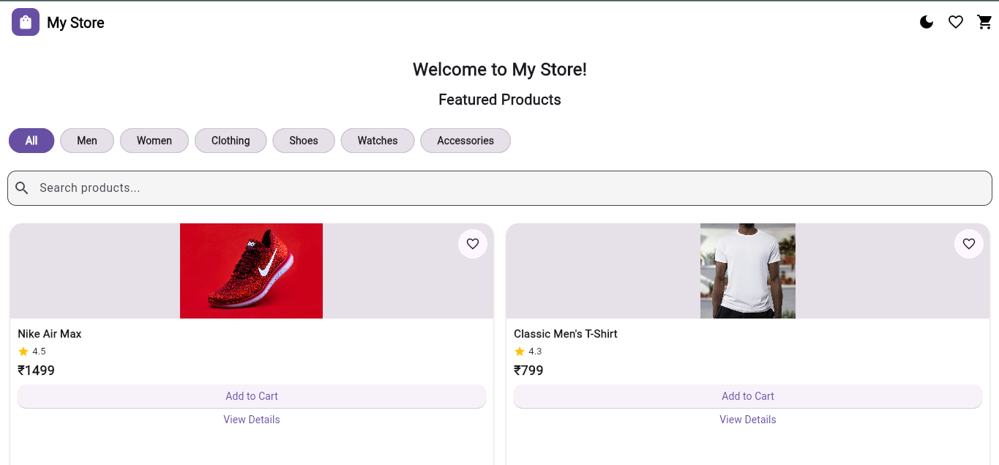
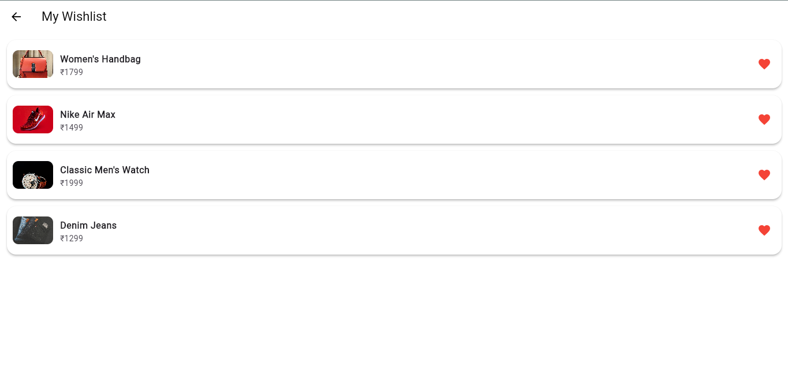
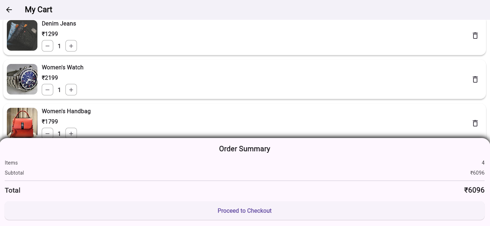
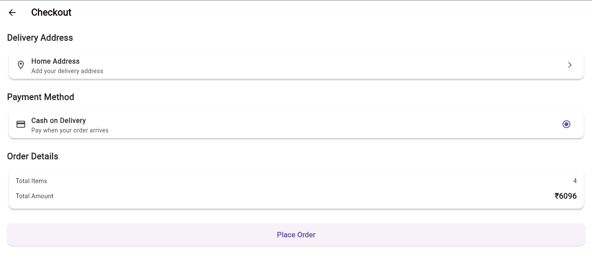

# 🛍️ My Store - Animated E-Commerce App

A modern Flutter e-commerce application with product browsing, search, category filtering, wishlist, cart management, animations, dark mode, local cart persistence, and a checkout flow.

## ✨ Features

- 🏠 Home screen with featured products
- 🔍 Product search
- 🏷️ Category filtering
- 📦 Product listing
- 🖼️ Product details with large images
- ⭐ Product ratings and customer reviews
- ❤️ Wishlist
- 🛒 Add to Cart
- ➕ Increase product quantity
- ➖ Decrease product quantity
- 🗑️ Remove products from cart
- 💰 Cart total and item count
- 💾 Cart persistence using local storage
- 🌙 Dark mode
- 💳 Checkout UI
- 🎉 Order success dialog

## 🎬 Animations

The application includes multiple Flutter animations:

- Hero animation for product images
- Product card fade and slide animation
- Page transition animation
- Animated add-to-cart / quantity transition

## 🛠️ Technologies Used

- Flutter
- Dart
- Provider
- SharedPreferences
- Material Design

## 📁 Project Structure

```text
lib/
├── models/
├── providers/
├── screens/
├── services/
├── widgets/
└── main.dart
```

## 📸 Screenshots

### 🏠 Home Screen



### 🔍 Search & Category Filtering


### ❤️ Wishlist



### 🖼️ Product Details


### 🛒 Cart



### 💳 Checkout



### 🎉 Order Placed


